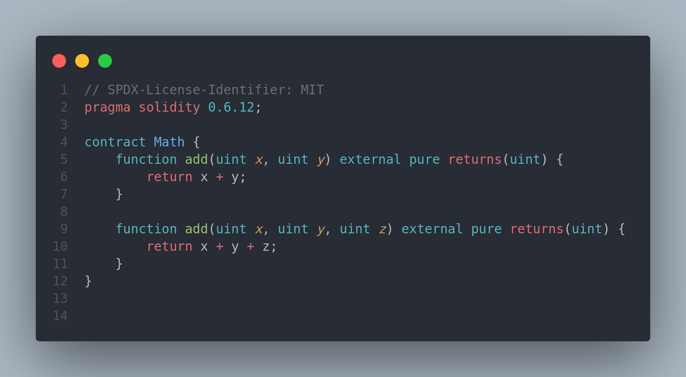

# **Smart Contract Development with Solidity** on Remix IDE

## Introduction to Smart Contract

A smart contract is a blockchain program or a code that is deployed to the blockchain so users and developers can interact with it. Smart contracts are written in a programming language called Solidity. Below is an example of a solidity smart contract

The solidity code above gets compiled to **bytecodes** which will target the Ethereum Virtual Machine(EVM). The EVM is a set of **opcodes** that are executed by the blockchain on the low level. The low level is the machine code.Solidity code is usually the source code which will eventually be the machine code to be executed by the EVM.

**Deploying a smart contract**

- Compile the solidity to byte code
- Send a transaction containing the bytecode to an EVM node (EVM Compatitble chains)
- The node then calculates an address for the smart contract and stores it in the blockchain

## Solidity Data Types

Let's start off with storage variables! These variables are stored in a contract's permanent data storage on the blockchain. When you modify a storage variable in a transaction, the updated value becomes globally accessible for subsequent reads and interactions.
In Solidity, declaring a storage variable is as simple as declaring the variable inside of the contract:

The Contract now has a boolean storage variable called myExample.
If you notice, the boolean value is uninitialized, so it's storage location holds **0x0** which translates to a default value in solidity. For booleans like myExample, the default is **false**. So when this contract code is deployed, myExample starts off as **false** .
Next, we going to add visibility by making our variable public and an initial value of true:

The keyword **public** was added which automatically generates a **getter** function for the variable. This getter function is used to read the value of the variable. Now we can access the value in myExample by calling a function on the contract with that very name: myExample().

## Practice Session

We will be using the Remix IDE to write and deploy smart contracts. Head over to [Remix IDE](https://remix.ethereum.org/) and create a new file.
You'll see a page like this

In the contract folder, create a new file with a **.sol** extension and go ahead and practice writing a smart contract.
To compile the code, click on the compile button at the sidebar. You'll see a message saying **Compilation successful** if there is no error in your code.

#### Unsigned Integer

To determine if a number is above or below zero we use the sign: + or -. An unsigned integer is an integer that has no sign. Solidity has a specific data type for unsigned integers called **uint**. A uint can be suffixed with the number of bits reserved for it. For instance uint8 means that there are eight bits provided for the value of the variable. Eight bits can range from 00000000 to 11111111. This range can represent 256 unique values. Since the range of unsigned integer values does not include negative numbers, it is simply 0 to 255. Here is a snippet of unsigned integer code:

You can go to your Remix IDE and practice more on unsigned integers with different logics like addition or other operations. And the compile the contract to see if there is any error.

#### Signed Integer

A signed integer can be declared with the keyword int. Just like uint, the keyword int is short for a data type that will store 256 bits of memory, int256.
Since an integer is signed, the range covers both negative and positive numbers. E.g **uint8** range from 0 to 255, but **int8** range from -128 to 127.

**Task**: Create four public storage variables and declare them with different signed integer types. The values of each of them should be positive and negative. Find the difference and sum between the values of the variables.

#### String Literals

String literals are created using double quotes. They are used to store text data. A string literal can be stored in both the bytes and string types. For a long human-readable message it is recommended to use string since it will be easier to read the values from the blockchain storage from the outside (like for a front-end application).
If the string is shorter than 32 bytes, it is more efficient to store it in a fixed-size byte array like bytes32.

#### Enums

In Solidity enums are custom data types consisting of a limited set of constant values. We use enums when our variables should only get assigned a value from a predefined set of values.
We define an enum with the enum keyword, followed by the name of the custom type we want to create. Inside the curly braces, we define all available members of the enum.
The Enum Type helps us write clean code!
Even though enum members are named when you define them, they are stored as unsigned integers, not strings. They are numbered in the order that they were defined, the first member starting at 0. The initial value of status, in this case, is 0.

#### Functions

After learning how to store values inside of our smart contracts, let's learn how to read and modify those values! We accomplish this by adding functions to our contract code.
Technically we already created functions in the previous lesson on data types! By setting our state variables to public, the compiler was creating a getter function under the hood. And we can modify it's value from a function.

The first function we'll talk about is the constructor:

Here we are setting the value of a storage variable on the contract's deployment. The constructor function is invoked only once during the contract's deployment and never again. It is generally used for setting up initial contract values.
What if we wanted to let the deployer of the contract decide the value of allow? We can do that by adding a parameter to the constructor function:

Notice how the parameter name (\_allow) has an underscore in front of it? This prevents the variable from having the same name as the storage variable. When the names collide it is referred to as variable shadowing.
If you noticed, there are two other functions in the contract. The **setAllow** function is used to change the value of the allow variable. The **getAllow** function is used to read the value of the allow variable.

###### Function Visibility

The visibility specifier is used to control who has access to functions and state variables. There are four types of visibilities: external, public, internal, and private. They regulate if functions and state variables can be called from inside the contract, from contracts that derive from the contract (child contracts), or from other contracts and transactions.

- Private: The default visibility. Only functions and state variables declared inside the contract can be accessed.
- Internal: The internal visibility allows functions and state variables to be accessed from inside the contract, from contracts that derive from the contract (child contracts), and from other contracts and transactions.
- Public: The public visibility allows functions and state variables to be accessed from inside the contract, from contracts that derive from the contract (child contracts), and from other contracts and transactions.
- External: The external visibility allows functions and state variables to be accessed only from outside the contract.

External visibility is quite similar to the public visibility for functions. External is better than public if you know that you are only calling the function externally (outside the EVM). Public visibility requires more gas because it can be called externally and internally, which complicates the assembly code.

###### Functions(View and Pure)

The **view** and **pure** keywords are used to specify that a function does not modify the contract's state. The view function is used to read data from the contract's storage. The pure function is used to read data from the contract's storage and does not modify the state.

###### Overloading Functions

In Solidity it is perfectly valid to declare two functions with the same name if they have different parameters

Solidity will run the function whose signature matches the arguments provided. For example, add(2,4) will invoke the first function while add(2,3,4) will invoke the second function.
Also, Solidity can return multiple values from functions:

Notice that the returns keyword specifies two return values. Also notice that we are wrapping the values in a parenthesis in order to return multiple values. This is referred to as a tuple. They are a list of values that can be used as a temporary structure to return values or do assignment destructuring. The data types of the return values in tuples can be different from each other.

## Accounts

In Ethereum, accounts are often distinguished into two types: **Externally Owned Accounts** and **Contract Accounts**. Every account on the EVM has a public address and a balance. When making a call from an EOA to a Contract Account it's important to know things like who is making the call, how much ether they are sending and the function they are intending to invoke with which arguments.
The Solidity language handles the wiring up of the transaction data to the function we have defined on the contract. The language also gives us access to the transaction parameters through globals like **msg.sender** and **msg.value**.

###### Solidity Addresses

An address on the EVM is a 160 bits long, or a 40 character, hexadecimal string:

**Task**: Create a public address state variable called owner on the contract and create a constructor function which will store the msg.sender in owner.

##### Let's Receive some Ethers

In the latest versions of Solidity, contracts cannot receive ether by default.
In order to receive ether, a contract must specify a payable function. This is another keyword which affects the function's mutability similar to view and pure.

The **msg.value** represents the amount of ether, in Wei, sent to the pay function. By simply adding the payable keyword to this function, it gains the ability to accept ether. Once received, the ether is automatically added to the contract's balance.
What if someone tried to send a payment to a nonpayable function? The transaction will fail, sending the ether back to the sender.
In the case above we used the method pay as a payable function. This means we have to call this function in order to send the ether to the contract. What if we wanted to send it directly without specifying a method?
Turns out, we can do that too:

You'll notice that receive does not use the function keyword. This is because it is a special function (like constructor). It is the function that runs when a contract is sent ether without any calldata, or when the calldata does not match a function signature on the contract. The receive function must be external, payable, it cannot receive arguments and it cannot return anything.

###### Transferring Funds

We can make any regular function payable. This allows us to differentiate the purpose of the ether coming into the smart contract.
Perhaps a contract has two stored addresses and we want to be able to pay each:

We have two pay methods payStudent and payTeacher which will transfer ether to the respective address. It takes a uint amount of Wei and transfers it from the contract account to the address.
**Task1**: Create a public payable function which sends any of its received ether to the owner
**Task2**: Take all funds that were passed to the receive function and donate them to charity. Do this in two steps:

- modify the constructor to accept a new argument: the charity address
- add a new function called donate. When this function is called transfer all remaining funds in the contract to the charity address.
  **Hint**: To get the amount of ether in the contract, use **address(this).balance**

## Reverting Transactions

When a transaction fails, the EVM will revert the transaction. This means that the state of the contract will not be modified. We can revert a transaction in Solidity by using the require function and the revert statement.
A require statement has two forms:

1. require(condition)
2. require(condition, "message")
   The revert keyword also has two forms:
3. revert CustomError(arg1,arg2,arg3,...)
4. revert("error message")
   Notice that, either way, revert does not take a boolean condition. Revert will always revert, so you will usually see it wrapped in a conditional statement
   

Let me create a withdrawal function that will withdraw all funds from the contract and send them to the deployer of the contract.
Requiring that only the deployer of the contract be allowed to call this function.

If you analyze the contract, you will see that 1 ether has been sent to the contract upon deployment. The withdraw function allows only the owner of the contract to be able to withdraw.

###### Function Modifiers

We can write modifiers on functions to run logic before and/or after the function body.
